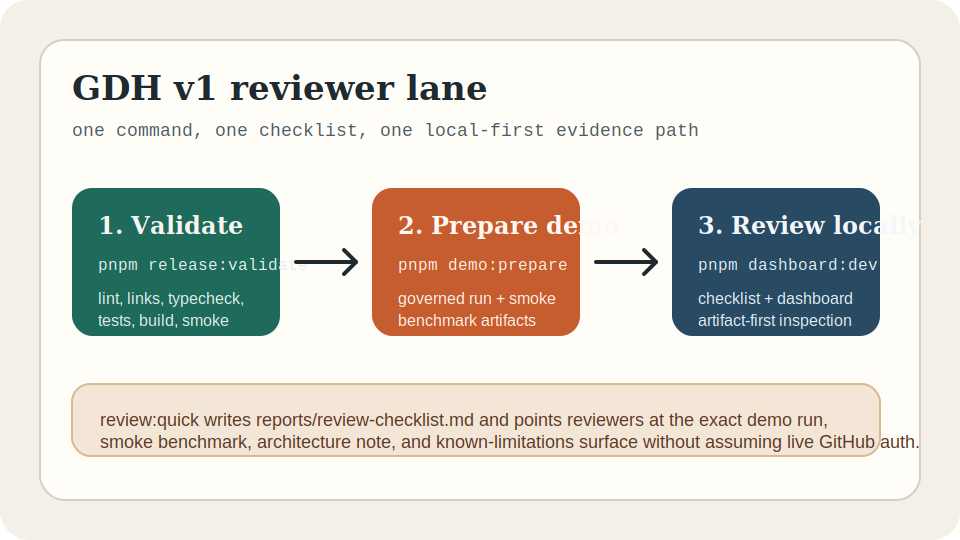

# Governed Delivery Control Plane

Version: `1.0.0`

GDH is a Codex-first governed execution layer for software-delivery work. It sits above a coding runner and turns a spec or GitHub issue into a bounded run with policy evaluation, approval stops, deterministic verification, durable artifacts, review-packet output, benchmark scoring, and a local dashboard over the resulting evidence.

This repository is the v1 public-showcase release: a local-first, evidence-backed control plane that stays intentionally conservative about what it automates and what its current evidence can prove.



## Why This Project Exists

Coding agents can produce useful changes, but the surrounding process is usually weak: plans live in chat, policy decisions are implicit, verification is easy to skip, and review context disappears once the session ends.

GDH exists to make that process inspectable:

- normalize work into a durable spec and plan
- evaluate repo policy before write-capable execution
- require approval for protected work
- persist run, diff, checkpoint, verification, and review artifacts locally
- package verified work for careful draft-PR review rather than direct merge
- benchmark the control plane itself with deterministic fixture-backed cases

## What Makes It Distinct

- It is not another coding agent. It is the governed layer above a coding agent.
- It is local-first and artifact-first. The source of truth is persisted evidence under `runs/` and `reports/`, not a hosted control plane or a chat transcript.
- It treats policy, approvals, verification, and review packets as first-class product surfaces.
- It measures itself with deterministic benchmarks aimed at the governed workflow, not with vague anecdotal demos.

## v1 Scope

The v1 showcase includes:

- `gdh run <spec-file>` and `gdh run --github-issue <owner/repo#123>`
- YAML policy packs with `allow`, `prompt`, and `forbid` outcomes
- approval packets and resumable approval-paused runs
- deterministic verification with persisted `verification.result.json`
- durable manifests, checkpoints, progress snapshots, `gdh status`, and `gdh resume`
- evidence-based review packets
- draft-PR-only GitHub delivery and local `/gdh iterate` comment intake
- deterministic benchmark execution, comparison, and regression gating
- bounded benchmark-driven optimization for an explicitly allowlisted config-only surface
- a local API and dashboard over persisted run and benchmark artifacts

## Non-Goals

This v1 release does not include:

- autonomous merge or deploy automation
- hosted multi-user infrastructure
- background workers, daemons, or webhook processors
- multi-agent orchestration
- open internet access by default
- broad self-optimization loops or arbitrary source-tree mutation

## Quickstart

### Requirements

- Node.js `20` or newer
- pnpm `10` or newer
- a local Git checkout
- optional: local Codex CLI auth for live `--runner codex-cli` runs
- optional: `GITHUB_TOKEN` for GitHub issue or draft-PR flows

### Install

```bash
git clone <repo-url>
cd GDH
pnpm bootstrap
```

`pnpm bootstrap` installs dependencies with the lockfile and prepares the tracked runtime directories used by runs, reports, and docs.

### Validate

```bash
pnpm release:validate
```

That runs the main local validation sweep:

- `pnpm lint`
- `pnpm lint:links`
- `pnpm typecheck`
- `pnpm test`
- `pnpm build`
- `pnpm benchmark:smoke`

## How To Evaluate This Project

The fastest honest path is now:

1. Read this README for scope, non-goals, and the reviewer path.
2. Run `pnpm review:quick`.
3. Open `reports/review-checklist.md`.
4. Start the dashboard with `pnpm dashboard:dev`.
5. Read [docs/architecture-overview.md](docs/architecture-overview.md), [reports/benchmark-summary.md](reports/benchmark-summary.md), and [reports/v1-release-report.md](reports/v1-release-report.md).

The default evaluator path is local-first and does not require live GitHub or live Codex execution.

If you prefer the manual path, use:

1. `pnpm release:validate`
2. `pnpm demo:prepare`
3. `pnpm gdh status <demo-run-id> --json`
4. `pnpm gdh verify <demo-run-id> --json`
5. [docs/demo-walkthrough.md](docs/demo-walkthrough.md)

## Architecture At A Glance

The core lifecycle is:

1. Normalize a spec or GitHub issue into a durable `Spec`.
2. Generate a bounded `Plan`.
3. Evaluate policy and create an approval packet when required.
4. Execute through the configured runner.
5. Persist run state, checkpoints, diffs, commands, and policy audit artifacts.
6. Run deterministic verification before completion.
7. Render a review packet.
8. Optionally package the verified run for a draft PR.
9. Expose the persisted evidence through the local API and dashboard.

Start with the concise architecture doc:

- [docs/architecture-overview.md](docs/architecture-overview.md)

For the more detailed package layout and internal module seams:

- [docs/architecture/release-candidate-overview.md](docs/architecture/release-candidate-overview.md)

## Demo

The quickest demo path is:

```bash
pnpm review:quick
pnpm dashboard:dev
```

`pnpm review:quick` runs `pnpm release:validate`, then `pnpm demo:prepare`, then writes `reports/review-checklist.md` plus `reports/review-checklist.latest.json`.

`pnpm demo:prepare` remains available directly. It builds the workspace, runs a safe fake-runner governed demo spec, runs the smoke benchmark suite, and writes a local summary to `reports/release/demo-prep.latest.json`.

Because the governed demo run executes the repo’s real verification commands against the current checkout, the happy path assumes a clean or otherwise validation-ready working tree.

Use the walkthrough for the full reviewer script, including approval, verification, benchmark, dashboard, and optional GitHub steps:

- [docs/demo-walkthrough.md](docs/demo-walkthrough.md)

## Benchmark Evidence

The benchmark surface is meant to validate the governed control plane, not to claim general autonomous coding performance.

Current corpus:

- `smoke`: `10` CI-safe cases
- `fresh`: `8` recent repo tasks normalized into deterministic cases
- `longhorizon`: `2` broader multi-file cases

Current reviewer-facing evidence:

- [reports/benchmark-summary.md](reports/benchmark-summary.md)
- [reports/benchmark-corpus-summary.md](reports/benchmark-corpus-summary.md)
- [docs/operations/bounded-optimization.md](docs/operations/bounded-optimization.md)

The latest referenced suite evidence in the repo shows:

- `smoke`: `10/10` passed with score `1.00` on `2026-03-24`
- `fresh`: `8/8` passed with score `1.00` on `2026-03-23`
- `longhorizon`: `2/2` passed with score `1.00` on `2026-03-23`

## Command Surface

### Governed Runs

```bash
pnpm gdh run [<spec-file>] [--github-issue <owner/repo#123>] [--runner codex-cli|fake] [--approval-mode interactive|fail] [--policy <policy-file>] [--json]
pnpm gdh status <run-id> [--json]
pnpm gdh resume <run-id> [--json]
pnpm gdh verify <run-id> [--json]
```

### GitHub Delivery

```bash
pnpm gdh pr create <run-id> [--branch <branch-name>] [--base-branch <base-branch>] [--json]
pnpm gdh pr sync-packet <run-id> [--comment-id <comment-id>] [--json]
pnpm gdh pr comments <run-id> [--json]
pnpm gdh pr iterate <run-id> [--json]
```

GitHub behavior stays conservative:

- draft PRs only
- no merge automation
- no deploy hooks
- no background polling
- missing credentials fail clearly

### Benchmarks

```bash
pnpm gdh benchmark run <suite-or-case> [--ci-safe] [--json]
pnpm gdh benchmark compare <lhs> [<rhs>] [--against-baseline] [--json]
pnpm gdh benchmark show <run-id> [--json]
pnpm benchmark:smoke
```

### Bounded Optimization

```bash
pnpm gdh optimize run <candidate-manifest> [--json]
pnpm gdh optimize compare <optimization-run-id> [--json]
pnpm gdh optimize decide <optimization-run-id> [--json]
```

The optimizer is intentionally narrow. In this session it can mutate only `config/optimization/impact-preview-hints.json`, and it rejects ties, regressions, missing comparisons, or any candidate that escapes that allowlist.

### Dev And Release Scripts

```bash
pnpm dev:api
pnpm dev:web
pnpm dashboard:dev
pnpm review:quick
pnpm validate
pnpm release:validate
pnpm demo:prepare
pnpm release:package
pnpm release:v1
```

## Artifact Model

Governed runs persist under `runs/local/<run-id>/`. Important artifacts include:

- `run.json`
- `events.jsonl`
- `session.manifest.json`
- `progress.latest.json`
- `plan.json`
- `impact-preview.json`
- `policy.decision.json`
- `approval-packet.*`
- `commands-executed.json`
- `changed-files.json`
- `diff.patch`
- `verification.result.json`
- `review-packet.*`
- `github/*` when GitHub delivery is used

Benchmarks persist under `runs/benchmarks/<benchmark-run-id>/`.

Bounded optimization runs persist under `runs/optimizations/<optimization-run-id>/`.

## Known Limitations

- Live `codex-cli` command capture remains partially self-reported.
- Verification is deterministic and evidence-backed, but it is not a proof system.
- Resume works only from explicit safe checkpoints.
- `/gdh iterate` handling is local-operator initiated and comment-prefix based.
- The dashboard is read-only over persisted artifacts; it does not mutate run state.
- GitHub draft-PR delivery exists, but the local evidence is stronger for the offline path than for the publish-capable path because fresh validation still assumes `GITHUB_TOKEN` is optional.
- `smoke` is the default CI-safe regression gate; broader `fresh` and `longhorizon` coverage are available but intentionally non-default.

## Live `codex-cli` Notes

Live `--runner codex-cli` runs are optional. Before using them, make sure:

- `codex` is available on `PATH`
- the local Codex CLI session is authenticated
- `~/.codex` is writable and its local state is healthy
- you understand GDH keeps network access off by default unless policy explicitly allows it

If a live run appears stuck, inspect:

- `pnpm gdh status <run-id>`
- `runs/local/<run-id>/progress.latest.json`
- `runs/local/<run-id>/runner.stderr.log`

The observed `state_5.sqlite` missing-migration warning is a Codex-local `~/.codex` issue, not a GDH artifact-store issue.

## Status

- Version: `1.0.0`
- License: `MIT`
- Status: public local-first showcase release for technical review and careful local evaluation
