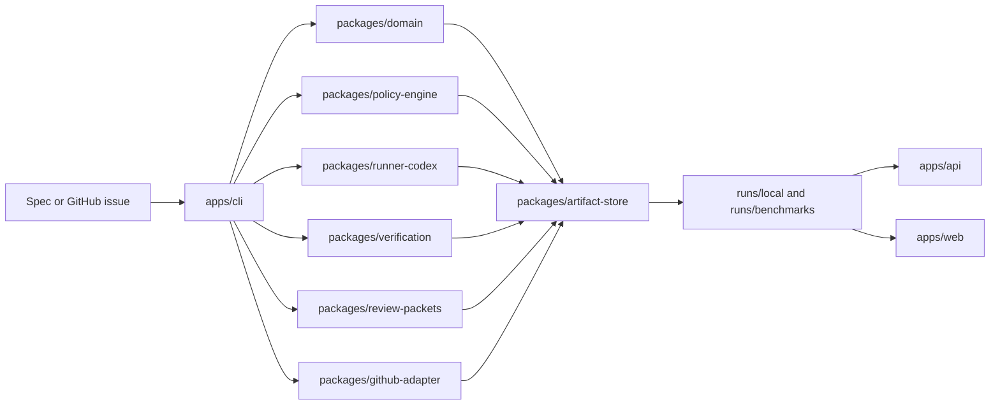

# Architecture Overview

This is a local-first control plane above a coding runner. The repo’s core idea is simple: treat agentic software delivery as a governed lifecycle with durable evidence instead of a chat transcript plus a diff.

## One-Sentence Thesis

GDH plans work, evaluates policy before write-capable execution, persists the run as inspectable artifacts, re-verifies the result, packages review evidence, and measures the whole workflow with deterministic benchmarks.

## System Shape

## What Each Layer Does

- `apps/cli` is the operator-facing entrypoint. It drives `run`, `status`, `resume`, `verify`, benchmark commands, and draft-PR packaging.
- `packages/domain` owns the canonical schemas, spec normalization, planning contracts, and run-session factories.
- `packages/policy-engine` turns repo policy into concrete allow, prompt, or forbid decisions and renders approval artifacts when a run must stop.
- `packages/runner-codex` is the execution boundary for the configured runner.
- `packages/verification` re-runs deterministic checks before a run can finish as completed.
- `packages/review-packets` turns the persisted evidence into a reviewable packet.
- `packages/github-adapter` stays thin and conservative: it packages already-verified runs for draft-PR delivery.
- `packages/artifact-store` is the durable backbone. It persists run artifacts and powers dashboard read models.
- `packages/evals` executes benchmark suites, compares runs to baselines, and records regression results.
- `apps/api` and `apps/web` are inspection surfaces over persisted artifacts, not a second mutable control plane.

## End-To-End Lifecycle

1. Input arrives as a markdown spec or GitHub issue.
2. The CLI normalizes it into a durable `Spec`.
3. The repo generates a bounded `Plan`.
4. Policy evaluation predicts likely impact and decides `allow`, `prompt`, or `forbid`.
5. Approved work executes through the configured runner.
6. The system persists run state, checkpoints, progress, changed files, diffs, commands, and policy audit evidence.
7. Deterministic verification must pass before the run is treated as completed.
8. A review packet is rendered from evidence-backed artifacts.
9. If the run is eligible and the environment supports it, the GitHub adapter can publish a draft PR.
10. The API and dashboard expose the same persisted evidence for inspection.

## What Makes This Different

- The differentiator is governance and continuity, not raw coding autonomy.
- GitHub is treated as a packaging surface after verification, not as the control plane.
- The dashboard reads artifacts that already exist; it does not invent hidden state.
- Benchmarks measure the governed lifecycle itself: policy correctness, verification correctness, packet completeness, artifact presence, and expected run outcomes.

## Trust Boundaries

- Default storage is local and file-backed.
- Network access is off by default in `.codex/config.toml`.
- Protected paths and risky work can require explicit approval.
- GitHub behavior is limited to issue reads, draft-PR creation, and comment-based iteration intake.
- Merge automation, deploy automation, background workers, and hosted services are out of scope for the v1 release.

## Reviewer Notes

If you only have a few minutes, validate the shape with these artifacts:

- [../README.md](../README.md)
- [demo-walkthrough.md](demo-walkthrough.md)
- [../reports/benchmark-summary.md](../reports/benchmark-summary.md)
- [../reports/v1-release-report.md](../reports/v1-release-report.md)

For the more detailed package layout and current module seams, continue to [architecture/release-candidate-overview.md](architecture/release-candidate-overview.md).
