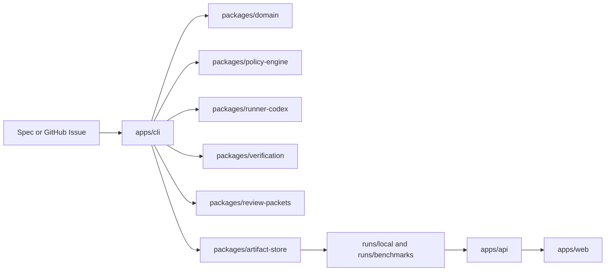

# Release Candidate Architecture Overview

For the quickest external-review path, start with [docs/architecture-overview.md](/Users/anf/Repos/GDH/docs/architecture-overview.md). This file remains the more detailed release-candidate package and module-boundary view.

This release candidate is a local-first control plane layered above a coding runner. The system treats plans, policy decisions, run artifacts, verification output, review packets, and benchmark results as durable evidence rather than transient chat state.

## Core Shape

## Execution Loop

1. `apps/cli` normalizes a spec or GitHub issue into a shared `Spec`.
2. `packages/domain` generates the bounded `Plan` and shared lifecycle records.
3. `packages/policy-engine` builds an impact preview, evaluates repo-local policy, and materializes approval artifacts when needed.
4. `packages/runner-codex` executes the approved task through the configured runner.
5. `packages/artifact-store` persists run state, command capture, changed files, diffs, checkpoints, review packets, and benchmark evidence under the local run directories.
6. `packages/verification` re-runs configured commands and deterministic checks before completion.
7. `packages/review-packets` renders the evidence-backed review packet for local inspection or draft PR publication.
8. `packages/evals` runs deterministic benchmark suites against the governed CLI surface.
9. `apps/api` and `apps/web` expose read-only inspection views over the persisted artifacts.

## Package Boundaries

- `apps/cli` owns orchestration and user-facing command flow.
- `packages/domain` defines canonical types and normalization helpers.
- `packages/policy-engine`, `packages/verification`, and `packages/review-packets` own the main governance and evidence logic.
- `packages/artifact-store` owns file-backed persistence and dashboard read models.
- `packages/github-adapter` stays a thin, explicit side-effect boundary.
- `packages/evals` stays deterministic and fixture-backed.
- `apps/api` and `apps/web` remain visibility layers only.

## Current Internal Module Seams

- `apps/cli` now keeps `src/index.ts` as a one-line public entrypoint that re-exports `src/program.ts`. The refactor pulled option contracts, git behavior, and summary formatting into `src/types.ts`, `src/git.ts`, and `src/summaries.ts`, but the lifecycle orchestration itself still lives in the large `program.ts` module.
- `packages/domain` now separates shared value sets in `src/values.ts`, schema and DTO contracts in `src/contracts.ts`, spec normalization and plan creation in `src/specs.ts`, and run/session/checkpoint factories in `src/runs.ts`.
- `packages/policy-engine` now separates policy-pack loading, impact previewing, rule matching and decision evaluation, approval artifact rendering, and post-run auditing into focused modules behind a small package entrypoint.
- `packages/verification` now separates config loading, verification command execution, claim and packet checks, completion gating, and the top-level verification orchestrator.
- `packages/evals` now exposes a small `BenchmarkTargetService` boundary for benchmark run/compare operations while separating config loading, run loading, catalog/target resolution, fixture-workspace preparation and case execution, artifact persistence, scoring, and comparison behind internal collaborators.

## Lifecycle Refactor Seam

The current release candidate still keeps the governed run state machine inside `apps/cli/src/program.ts`, primarily across `runSpecFile`, `resumeRunId`, `statusRunId`, `verifyRunId`, and the remaining helper cluster that persists manifests, checkpoints, progress snapshots, and inspection state.

That shape is stable enough for the current release boundary, but it is the main deep-module candidate for the next refactor. The intended direction is to keep the CLI thin and move lifecycle ownership behind a dedicated `RunLifecycleService` with a narrow `run`/`status`/`resume` API backed by a private transition engine that owns coherent durable state bundles, without changing the current artifact-backed guarantees.

That future service is not intended to be one more large file under a new name. The RFC now treats it as a thin public facade over private lifecycle context loading, transition planning, durable commit, and inspection modules so the repo gains one deeper seam instead of another orchestration cluster.

Concretely, the refactor target is to collapse three concerns behind that service boundary:

- forward lifecycle transitions currently driven from `runSpecFile` and `resumeRunId`
- inspection, continuity assessment, and resume planning currently coordinated through `prepareRunInspection` and `statusRunId`
- atomic ownership of the durable bundle around `run.json`, `session.manifest.json`, checkpoints, progress snapshots, and stage artifacts such as `plan.json`, `policy.decision.json`, and `verification.result.json`

One additional seam matters for downstream consumers: GitHub publication and comment helpers currently reuse `prepareRunInspection`, so delivery-oriented reads also reconcile interruption state, continuity, and resume planning. The future lifecycle service should keep that reconciliation logic inside one module and give downstream helpers typed inspection snapshots instead of letting each helper decide when lifecycle artifacts are rewritten.

The intended downstream shape is equally narrow: benchmark execution should call the lifecycle boundary instead of proving CLI choreography, and GitHub publication should consume typed lifecycle inspection results instead of rebuilding durable state from scattered helper reads or side-effectful inspection helpers.

See [run-lifecycle-service-rfc.md](/Users/anf/Repos/GDH/docs/architecture/run-lifecycle-service-rfc.md).

## Release-Candidate Defaults

- local file-backed artifact store
- network access disabled by default in `.codex/config.toml`
- draft-PR-only GitHub delivery
- no background workers
- no hosted services
- no merge or deploy automation

## Why This Shape Matters

- It keeps policy, verification, and review output inspectable.
- It lets the dashboard explain runs without becoming a second source of truth.
- It preserves a clean path from local demo usage to future extensions without overbuilding the release candidate.
