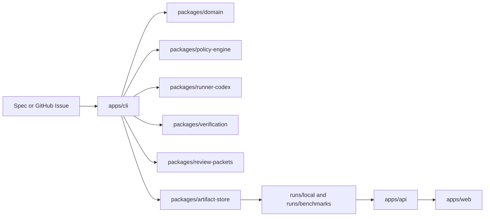

# Release Candidate Architecture Overview

This release candidate is a local-first control plane layered above a coding runner. The system treats plans, policy decisions, run artifacts, verification output, review packets, and benchmark results as durable evidence rather than transient chat state.

## Core Shape

## Execution Loop

1. `apps/cli` normalizes a spec or GitHub issue into a shared `Spec`.
2. `packages/domain` generates the bounded `Plan` and shared lifecycle records.
3. `packages/policy-engine` builds an impact preview, evaluates repo-local policy, and materializes approval artifacts when needed.
4. `packages/runner-codex` executes the approved task through the configured runner.
5. `packages/artifact-store` persists run state, command capture, changed files, diffs, checkpoints, review packets, and benchmark evidence under the local run directories.
6. `packages/verification` re-runs configured commands and deterministic checks before completion.
7. `packages/review-packets` renders the evidence-backed review packet for local inspection or draft PR publication.
8. `packages/evals` runs deterministic benchmark suites against the governed CLI surface.
9. `apps/api` and `apps/web` expose read-only inspection views over the persisted artifacts.

## Package Boundaries

- `apps/cli` owns orchestration and user-facing command flow.
- `packages/domain` defines canonical types and normalization helpers.
- `packages/policy-engine`, `packages/verification`, and `packages/review-packets` own the main governance and evidence logic.
- `packages/artifact-store` owns file-backed persistence and dashboard read models.
- `packages/github-adapter` stays a thin, explicit side-effect boundary.
- `packages/evals` stays deterministic and fixture-backed.
- `apps/api` and `apps/web` remain visibility layers only.

## Lifecycle Refactor Seam

The current release candidate keeps the governed run state machine inside `apps/cli`, primarily across `runSpecFile`, `resumeRunId`, `statusRunId`, `verifyRunId`, and the helper cluster that persists manifests, checkpoints, progress snapshots, and inspection state.

That shape is stable enough for the current release boundary, but it is the main deep-module candidate for the next refactor. The intended direction is to keep the CLI thin and move lifecycle ownership behind a dedicated `RunLifecycleService` with a narrow `run`/`status`/`resume` API backed by a private transition engine that owns coherent durable state bundles, without changing the current artifact-backed guarantees.

See [run-lifecycle-service-rfc.md](/workspace/GDH/docs/architecture/run-lifecycle-service-rfc.md).

## Release-Candidate Defaults

- local file-backed artifact store
- network access disabled by default in `.codex/config.toml`
- draft-PR-only GitHub delivery
- no background workers
- no hosted services
- no merge or deploy automation

## Why This Shape Matters

- It keeps policy, verification, and review output inspectable.
- It lets the dashboard explain runs without becoming a second source of truth.
- It preserves a clean path from local demo usage to future extensions without overbuilding the release candidate.
